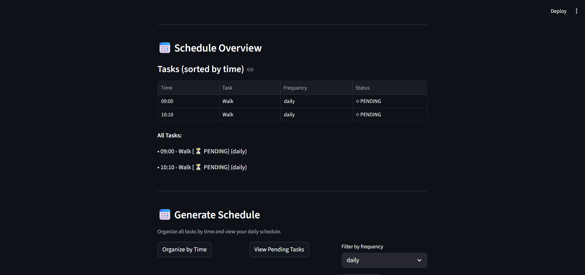

# PawPal+ Pet Care Scheduler

**PawPal+** is a Streamlit app that helps pet owners efficiently plan and track daily pet care tasks. It organizes tasks by time, detects scheduling conflicts, and manages recurring tasks automatically.

## Quick Start

### Installation

```bash
# Create and activate virtual environment
python -m venv .venv
.venv\Scripts\activate          # Windows
source .venv/bin/activate       # macOS/Linux

# Install dependencies
pip install -r requirements.txt
```

### Running the App

```bash
streamlit run app.py
```

The app will open at `http://localhost:8501` in your browser.

---

## Using PawPal+

### 1. Create Owner Profile
- Enter the owner's name (e.g., "Jordan")
- Click **Create Owner** to initialize the system

### 2. Add Pets
- Enter pet name (e.g., "Mochi")
- Select species (dog, cat, or other)
- Click **Add Pet** to register the pet

### 3. Create Tasks
- Select which pet the task belongs to
- Enter task description (e.g., "Walk dog", "Feed cat")
- Set the scheduled time (hours 0-23, minutes 0-59)
- Choose frequency:
  - **daily** – Task repeats every day
  - **weekly** – Task repeats every 7 days
  - **monthly** – Task repeats every ~30 days
  - **once** – One-time task only
- Click **Add Task** to schedule the task

### 4. View Schedule
The **Schedule Overview** section displays:
- **Sorted Tasks** – All tasks organized by time (earliest first)
- **Conflict Warnings** – Visual alerts if multiple tasks are at the same time
- **Task Details** – Time, description, frequency, and completion status



#### Conflict Detection
If tasks overlap, you'll see an alert like:
```
⚠️ Found 1 time slot(s) with conflicts:
  09:00 - 2 tasks scheduled:
    • Walk dog
    • Groom dog
```

This helps you identify scheduling issues to resolve.

---

## System Architecture

See [UML_DIAGRAM.md](UML_DIAGRAM.md) for the complete class design.

### Core Classes

**Task** – Represents a single pet care activity
- Time, frequency (daily/weekly/monthly/once), date, completion status
- Auto-creates next occurrence when marked complete (if recurring)

**Pet** – Manages tasks for a specific pet
- Associates pet name, breed, and owner
- Stores all tasks belonging to the pet

**Owner** – Manages multiple pets
- Aggregates all pets and their tasks
- Provides access to entire pet care inventory

**Scheduler** – The "brain" of the system
- Organizes tasks by time
- Detects scheduling conflicts
- Tracks pending tasks
- Manages recurring task creation

---

## Testing

The project includes comprehensive unit tests covering:
- **Sorting correctness** (empty, single, reverse order, midnight edge cases)
- **Recurrence logic** (daily/weekly/monthly chains, month-end, leap years)
- **Conflict detection** (same time, multiple pets, 5+ tasks)
- **Task filtering** (by frequency, by time, pending only)

### Run All Tests

```bash
python -m pytest test_pawpal_system.py -v
```

### Run Specific Test Category

```bash
# Sorting tests
python -m pytest test_pawpal_system.py -k organize -v

# Recurrence tests
python -m pytest test_pawpal_system.py -k recurring -v

# Conflict tests
python -m pytest test_pawpal_system.py -k conflict -v
```

### Test Coverage Summary

Total: **35 test cases** across:
- **8 sorting tests** – Validate `organize_tasks()` with various orderings
- **8 recurrence tests** – Verify recurring task behavior and chains
- **9 conflict tests** – Test conflict detection across different scenarios
- **10 existing tests** – Task completion, pet management, frequency types

All tests pass ✓

---

## Important Edge Cases Handled

✅ **Midnight (00:00)** – Sorts to beginning of day  
✅ **Month-end recurring** – Jan 31 + 30 days = Mar 2 (not Feb 29)  
✅ **Leap year tasks** – Handles Feb 28/29 correctly  
✅ **Recurring task chains** – Multiple completions create sequential dates  
✅ **5+ conflicts at once** – All detected, not just the first pair  
✅ **Cross-pet conflicts** – Detects when 2+ pets have tasks at same time  
✅ **Stable sorting** – Tasks at same time maintain insertion order  

---

## File Structure

```
.
├── app.py                      # Streamlit UI interface
├── pawpal_system.py            # Core business logic (Task, Pet, Owner, Scheduler)
├── test_pawpal_system.py       # 35 comprehensive unit tests
├── UML_DIAGRAM.md              # Architecture diagram (Mermaid)
├── README.md                   # This file
└── requirements.txt            # Python dependencies
```

---

## Troubleshooting

| Issue | Solution |
|-------|----------|
| App won't start | Ensure Streamlit is installed: `pip install streamlit` |
| Tests won't run | Install pytest: `pip install pytest` |
| Import errors | Verify `pawpal_system.py` is in the same directory |
| Conflicts not showing | Add multiple tasks at the exact same time (e.g., 09:00) |
| Recurring tasks not created | Only daily/weekly/monthly frequencies auto-create; "once" tasks don't |

---

## Future Enhancements

- Add task priority levels
- Implement task duration/time blocking
- Add owner preferences for task ordering
- Dashboard with completion statistics
- Export schedules to calendar format
- Multi-owner support
