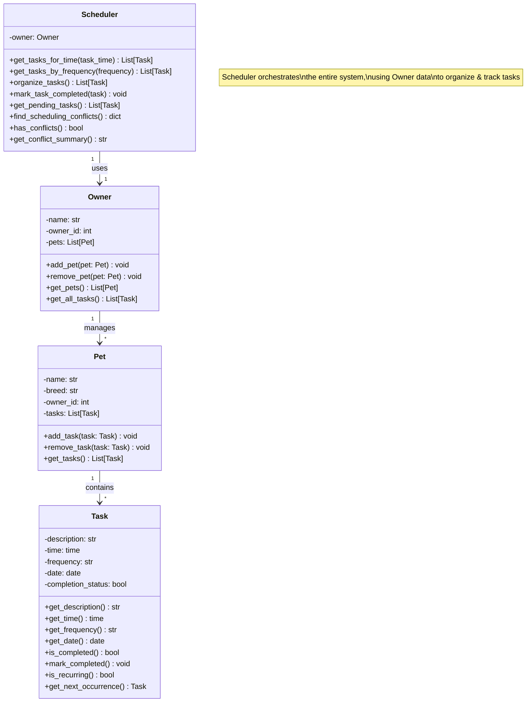

# PawPal+ System UML Diagram

## Class Diagram (Mermaid)

## Architecture Overview

- **Task**: Represents a single pet care activity with time, frequency, and completion status
- **Pet**: Manages a collection of tasks for a specific pet
- **Owner**: Manages multiple pets and aggregates all their tasks
- **Scheduler**: Orchestrates the system, providing sorting, conflict detection, and recurring task management
